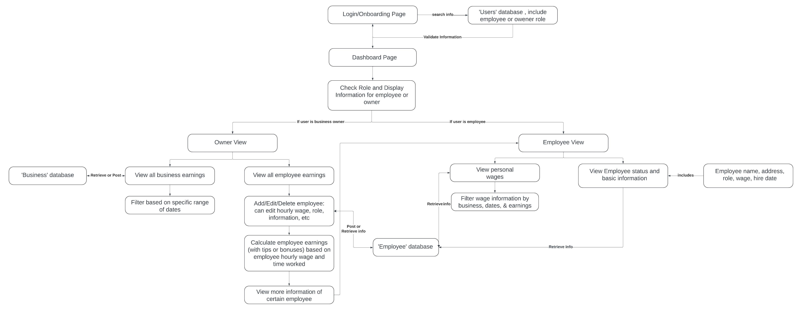

# Group 8's Final Project Proposal
This is the INFO 441 final project proposal for Group 8.

By: Michaelangelo Labrador, Hyejin Park, Anthony Wen, Jasmine Wong

**Link: https://business-management-tool.onrender.com/**

## Project Description

#### Who is your target audience?  Who do you envision using your application? Depending on the domain of your application, there may be a variety of audiences interested in using your application.  You should hone in on one of these audiences.

Our application is designed for business owners who want to keep track of employee information and financial data to calculate accurate salaries. If they input hourly wages, tips, and bonuses, the application will automatically calculate the total based on hours worked. This ensures that all wages are accurate, allowing owners to easily check how many hours employees worked and their hourly wages. 
It would let owners filter an individual's payroll for that month, or over a certain time period. The entire app would basically allow owners to input, process and output financial information for employees for bookkeeping.

#### Why does your audience want to use your application? Please provide some sort of reasoning.

Our application enables business owners to efficiently manage employee information and track financial data to meet essential obligations. Beyond storing details on new, current, and past employees, the application offers tools to calculate accurate pay-to-date information based on hourly wages and annual hours worked which can be provided for users. Users can access automatically recorded financial data, easily shareable with their employees and governmental regulators, such as the IRS. Additionally, financial income data helps analyze patterns, supporting informed decision-making to enhance the business’s financial health and overall performance while having the ease of digital tools to make financial tracking easier.

#### Why do you as developers want to build this application?

As developers we want to build this application to support business owners, in managing employee wages, hours, and additional earnings, with efficiency. Accurate financial tracking is important for both management and staff. We want to build this application to handle these calculations accurately and efficiently for ease of use for business owners. This application will provide us with a valuable opportunity to learn more about financial management and building a tool that can support data storing and calculating wages. Our goal is to create a comprehensive application that makes the payroll and employee management process more efficient and reliable.

## Technical Description

### Architectural Diagram

### Data Flow Diagram

### Summary Table for User Stories
| Priority | User | Description | Technical Implementation |
|---|---|---|:---:|
| P0 | As a user | I want to be able to create an account and log into/out of it. | When logging in, use Azure Authentication to authenticate users, and place them into our database. |
| P0 | As a business owner user | I want to be able to store my business name. | When logged in, use Mongo DB to add a business so employees can be managed by business. |
| P1 | As a business owner user | I want to be able to add information about my business earnings. | Using back end custom api, we will be able to save business earnings information and pull them. |
| P1 | As a business owner user | I want to be able to create/edit/delete employee data when new employees get hired or move on. | When logged in, use Mongo DB to add on or edit current information for each employee. |
| P1 | As a business owner user | I want to be able to see the sum of wages for each employee. | Using back end custom api, we will be able to send the total and save it in Mongo DB whenever the wage or hours are added |
| P1 | As a employee user | I want to be able to view my wages for each shift. | Using back end custom api, we will send the information from Mongo DB about the employee back to the front end so the employee can view their pay stub. |
| P2 | As a business owner user | I want to be able to query and filter financial information and employee data. | Using back end custom api, we will be able to send back information from Mongo DB based on the user’s query. |
| P2 | As a business owner user | I want to be able to store and access disciplinary records of each employee. | Use Mongo DB to create collections of records connected to employees via unique user id |
| P2 | As a business owner user | I want to be able to check my monthly records or records for a certain date range | Creating a table to filter the results for a certain time period (filter by date) |

## API Endpoints
- User
    - GET /user/login -  Allows users to log into their account.
- Business
    - GET /business/:id/info - Gathers business information including sales and employees
    - POST /business/create - Allows users to create new businesses
- Employee
    - GET /employee/:id/info - Allows users to gather employee information and earnings
    - DELETE /employee/:id/info - Allows users to remove employee information and earnings
    - POST /employee/:id/info - Allows users to add employee information and earnings
        - Also, calculates total earnings based on current employee data and writes to the database.
    - PUT /employee/:id/info - Allows users to edit/update employee information and earnings
    - GET /employee/:id/profile - Allows employees to see their information and earnings

## Database Schema
- Users
    - UserID (number)
    - Azure username (string)
    - Role (string)
    - BusinessID (string)
- Business
    - BusinessID (string)
    - Business earnings (number)
    - List of EmployeesID (list of number)
- Employees
    - EmployeeID (number)
    - Name (string)
    - Hours worked (number)
    - Hourly wage (number)
    - Earnings (number)